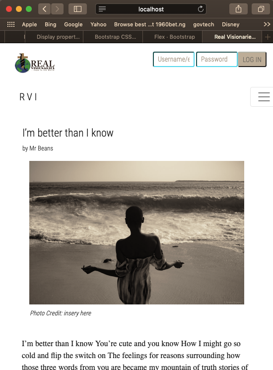
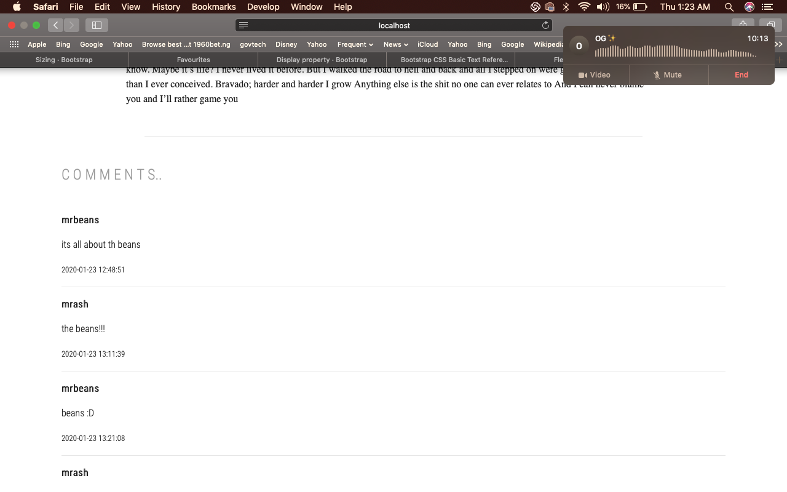
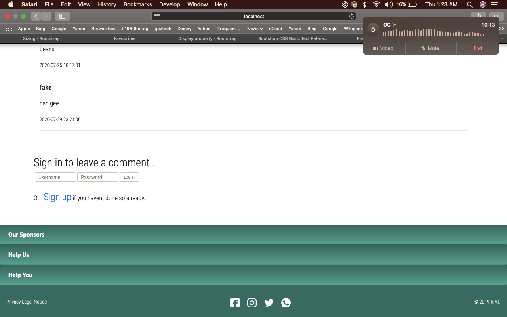

If youre running MAMP on a Mac the connection file is in:
htdocs/RVI/sections/creator/connection.php

download the folder and place it in your localhost folder.

if you're on windows with WAMP or XAMP

alter the values for root, db, host, password. to match your local settings.

import the database values from the sql file provided at: 
htdocs/RVI/rvi-2.sql
it contains the tables and data to provide the content on the app

Landing Page inc. Header

Body

Footer

article Mobile

article comments

article footer

